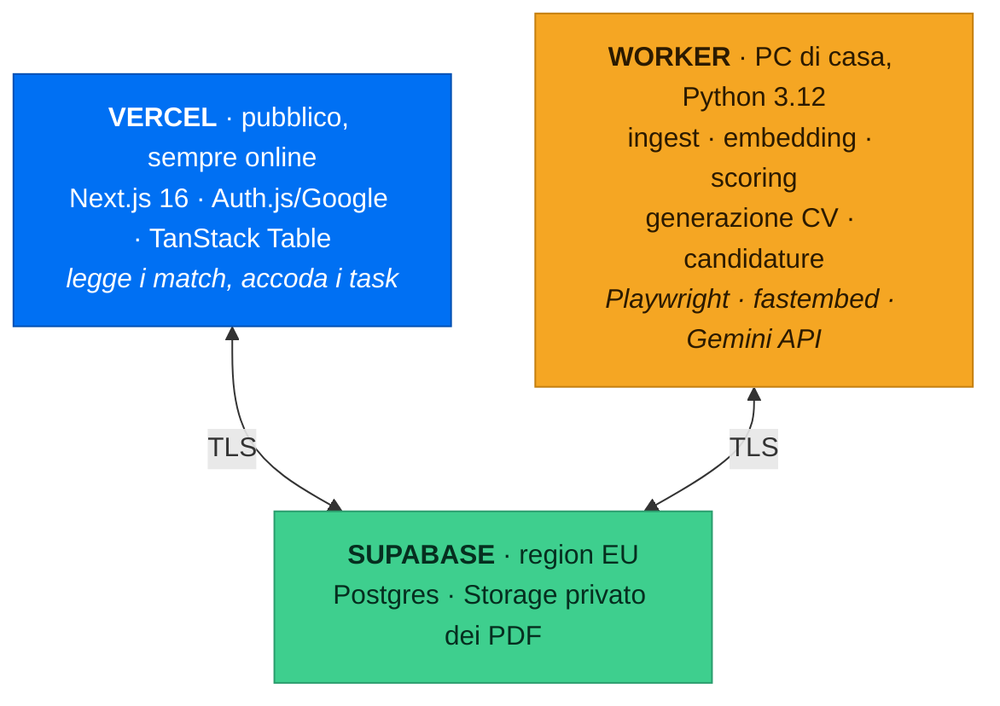

<div align="center">

# JobBoard

**Cerca lavoro mentre dormi.**

Ogni giorno raccoglie annunci da più portali, li confronta con il tuo CV, li ordina per
compatibilità — e con un click genera un CV su misura per quel singolo annuncio e invia
la candidatura.


</div>

---

## Cosa fa

Una dashboard privata, raggiungibile da qualsiasi dispositivo, con una tabella di offerte
già filtrate e valutate:

| Ruolo | Azienda | Luogo | Modalità | RAL | Tipo | Match | |
|---|---|---|---|---|---|---|---|
| Backend Engineer | Acme Srl | Milano | 🔵 Ibrido | 45–55k € | Indeterminato | **87%** | `Candidati` |
| Full-Stack Dev | Globex | Berlino | 🟢 Remote | n.d. | Indeterminato | **74%** | `Candidati` |
| Software Engineer | Initech | Torino | 🟠 On-site | 38–42k € | Determinato | **61%** | `Candidati` |

Premendo **Candidati**, il sistema:

1. legge la job description e ne estrae i requisiti reali
2. riscrive il tuo CV per quell'annuncio — riordinando e riformulando, **senza inventare nulla**
3. lo impagina in **una sola pagina**, ATS-friendly, nella lingua dell'annuncio
4. te lo mostra per approvazione, poi apre il form di candidatura in un browser sul tuo PC,
   già compilato — **e si ferma**: l'invio lo premi tu, guardando lo schermo

La RAL viene mostrata solo se l'annuncio la dichiara davvero. Mai stimata e spacciata per certa.

## Come funziona

```
[1 INGEST] → [2 NORMALIZE + DEDUP] → [3 ENRICH] → [4 MATCH] → [5 DASHBOARD]
                                                                    ↓
                                                   [6 TAILOR CV] → [7 APPLY] → [8 TRACK]
```

Gli stadi 1–4 girano una volta al giorno da soli. Gli stadi 6–7 partono dal tuo click.

### Il matching è un imbuto, non una chiamata a un LLM

Mandare 500 annunci al giorno a un modello linguistico è insostenibile. Mandarne 40 no.
Ogni stadio scarta il più possibile con il metodo più economico disponibile:

| Stadio | Metodo | Costo | Misurato su 153 annunci |
|---|---|---|---|
| 0 · Filtri duri | Lingua, work authorization, seniority, luogo, città, età | zero | restano 44 |
| 1 · Semantico | Embedding multilingua in locale + BM25 sulle competenze | zero | restano 40 |
| 2 · Rubrica | Gemini Flash Lite, 6 criteri pesati | free tier | 40 chiamate, ~5 min |

Due regole tengono in piedi l'imbuto, e le ha imposte entrambe la prima esecuzione vera:

- **Un dato mancante non esclude.** Un terzo degli annunci non dichiara il paese e due
  quinti non dichiarano il livello. Trattare quel silenzio come una risposta negativa
  trasformerebbe un buco nei dati della fonte in un'offerta persa.
- **Assenza di prove non è prova di eccellenza.** Un annuncio senza requisiti dichiarati
  non dà una copertura del 100%: dà un "non lo so". Senza questa regola il punteggio più
  alto del primo giro è finito a un annuncio da contabile che il modello stesso definiva
  "completamente slegato dal profilo".

## Architettura

Split: l'interfaccia sta in cloud ed è sempre raggiungibile, il lavoro pesante gira in locale.



I due lati non si parlano mai direttamente: la UI scrive un task in una coda su Postgres e
il worker lo raccoglie entro 30 secondi (`FOR UPDATE SKIP LOCKED`).

**A PC spento** la dashboard resta consultabile e i task restano in coda fino al riavvio.
La testata mostra sempre se il worker è online, così non c'è mai ambiguità.

<details>
<summary><b>Perché il worker non sta su Vercel</b></summary>

Le funzioni serverless hanno filesystem effimero, bundle limitato a ~250 MB e timeout di
pochi minuti. Non ci stanno Playwright/Chromium, il runtime ONNX per gli embedding, né una
pipeline che macina centinaia di annunci con chiamate LLM.

E la candidatura è *headful* per definizione, non solo per l'ATS sconosciuto: nessun
ATS lascia inviare una candidatura via API senza credenziali dell'azienda (Greenhouse
la blocca perfino con un reCAPTCHA), quindi anche gli ATS "noti" passano dallo stesso
browser che devi guardare mentre compila un form — che non può girare su un server.

</details>

## Stack

| | Tecnologia | Perché |
|---|---|---|
| **Frontend** | Next.js 16, Tailwind 4, shadcn/ui, TanStack Table | Server-side per Auth.js e per non esporre mai la connection string |
| **Worker** | Python 3.12, SQLAlchemy 2, Alembic, APScheduler | Ecosistema maturo per parsing CV, embedding e automazione browser |
| **Database** | Supabase Postgres, region EU | Un solo servizio per DB *e* storage dei PDF, con signed URL nativi |
| **Embedding** | fastembed + `multilingual-e5-small`, su CPU | Gratis, multilingua IT/EN/DE, gira senza GPU |
| **LLM** | Gemini 2.5 Flash-Lite (scoring) · Flash (CV) | Free tier: l'imbuto tiene il volume LLM cosi' basso da starci dentro |
| **PDF & apply** | Playwright Chromium | Una dipendenza sola per rendering PDF *e* automazione dei form |

## Stato

| Fase | | Contenuto |
|---|---|---|
| 0 · Fondamenta | ✅ | venv, 13 tabelle su Supabase, Alembic, Next.js, shadcn, Playwright |
| 1 · Profilo e CV master | ✅ | Parsing PDF/DOCX, `MasterProfile`, risposte ATS, embedding locale |
| 2 · Ingestione | ✅ | 10 adapter, normalizzazione, parsing RAL, dedup SimHash |
| 3 · Matching | ✅ | Imbuto a 3 stadi, rubrica pesata, calibrazione dei pesi |
| 4 · Dashboard | ✅ | Auth Google, tabella, filtri, drawer — in produzione su Vercel, login verificato |
| 5 · Ponte UI↔worker | ✅ | Coda task, heartbeat, progresso |
| 6 · Generazione CV | ✅ | Tailoring ACR, validatore anti-invenzione, fit a una pagina |
| 7 · Candidatura | 🔸 | Router, form precompilato (selettori noti + euristica), guardrail — non ancora provato su un annuncio vero |
| 8 · Run giornaliera | ✅ | Raccolta automatica, digest email, pagina Impostazioni e Cronologia — provate con un account Gmail vero |
| 9 · Tracking | 🔸 | Stati, lettura IMAP, classificazione risposte, promemoria, metriche — non ancora provato con un account Gmail e un LLM veri |
| 10 · Rifinitura | 🔸 | Dashboard costi (`/costi`), backup CSV automatico — manca solo la ricalibrazione dei pesi, che serve due settimane d'uso reale |
| 11 · Città e informazioni applicante | 🔸 | Filtro sulla città allo Stadio 0, pool libero di informazioni applicante (`jb info`, sezione CV) che la Fase 6 può citare in aggiunta al profilo — non ancora provato contro un Postgres e un LLM veri |
| 12 · Rivalutazione e avvio automatico | ✅ | Bottone "Rivaluta tutto" (`--rescore` dalla dashboard), avvio/arresto automatico del worker per entrambi i bottoni con interruttore in Impostazioni — verificato su Postgres, worker e Task Scheduler veri (tre cause reali di stallo trovate e corrette: interruttore spento, attività disabilitata, e un task `running` orfano dopo un worker interrotto — recupero automatico e log durante i ritentativi in `jb work`/`jb doctor`) |
| 13 · Attività pianificate senza finestra e interruttori dedicati | ✅ | Le tre attività di Task Scheduler non aprono più una console; ciascuna ha un interruttore proprio in Impostazioni (non solo il worker) e `jobboard doctor` segnala tutte e tre se disabilitate o spente |

Dettaglio completo con sottofasi e criteri di verifica in **[docs/ROADMAP.md](docs/ROADMAP.md)**.

## Setup da zero

Sei passi, in ordine: un account non ha senso prima di sapere a cosa serve, e il
worker non ha un database finché le migration non girano almeno una volta.

<details open>
<summary><b>0. Account e chiavi</b> — solo sui siti veri, non da questa pagina</summary>

Serve un progetto **Supabase** (Postgres + Storage, region `eu-central-1`), un
account **Vercel** collegato al repository, credenziali **Google OAuth** e le
chiavi delle fonti gratuite che vuoi accendere (Adzuna, Jooble, RapidAPI per
JSearch), più una **API key** del provider LLM attivo (Gemini, free tier). L'elenco
completo — cosa creare, dove, e perché — è nei **[Prerequisiti di
ROADMAP.md](docs/ROADMAP.md#prerequisiti--cose-che-può-fare-solo-filippo)**: nomi di
schede e bottoni sulle console di terzi cambiano più spesso di questo file, quindi
lì si punta al posto giusto invece di ricopiare screenshot che invecchiano.

Tutte le chiavi finiscono in `worker/.env` (mai committato) e nelle Environment
Variables del progetto Vercel — template in `.env.example` e `.env.local.example`.

</details>

<details open>
<summary><b>1. Worker</b> — Python 3.12 richiesto</summary>

```bash
py -3.12 -m venv worker/.venv
worker/.venv/Scripts/python -m pip install -e "worker[dev]"
worker/.venv/Scripts/python -m playwright install chromium
cp .env.example worker/.env      # poi compila le chiavi del passo 0
```

</details>

<details open>
<summary><b>2. Schema del database</b> — una volta sola su un progetto Supabase nuovo</summary>

```bash
cd worker
.venv/Scripts/alembic upgrade head    # crea tutte le tabelle, indici e vincoli
.venv/Scripts/jobboard doctor         # verifica chiavi, connessione, Playwright
```

`doctor` verifica ogni chiave, la connessione al database e Playwright, senza mai
stampare il valore di un segreto — è il comando giusto per capire cosa manca prima
di incolpare il passo successivo.

</details>

<details>
<summary><b>3. Profilo</b> — il CV che ogni punteggio e ogni CV generato userà</summary>

```bash
worker/.venv/Scripts/jobboard profile import CV.pdf   # estrae e struttura con l'LLM
# correggi worker/data/cv/master_profile.json a mano — è il passaggio che conta di più
worker/.venv/Scripts/jobboard profile load --reviewed
```

</details>

<details>
<summary><b>4. Dashboard</b> — Node 20+, in locale</summary>

```bash
cd web
npm.cmd install
cp .env.local.example .env.local  # poi compila le chiavi del passo 0
```

Poi, dalla radice del progetto:

```bash
.\web dev
```

`web.cmd` esiste per lo stesso motivo di `jb.cmd`: su Windows con execution policy
`AllSigned` il comando `npm` e' lo script `npm.ps1`, non e' firmato e PowerShell lo
rifiuta. `npm.cmd` non e' uno script PowerShell e passa senza dover abbassare una
impostazione di sicurezza dell'intera macchina. Funzionano `.\web dev`, `.\web build`,
`.\web lint`.

</details>

<details>
<summary><b>5. Deploy su Vercel</b> — la dashboard pubblica</summary>

Collega il repository al progetto Vercel del passo 0, replica le variabili di
`.env.local.example` nelle sue Environment Variables e fai il primo deploy. Il
redirect OAuth di Google Cloud Console va aggiornato con il dominio Vercel vero
(`https://IL-TUO-DOMINIO/api/auth/callback/google`) prima che il login funzioni.

</details>

<details>
<summary><b>6. Raccolta automatica e backup</b> — solo Windows, sul PC che fa da worker</summary>

```bash
.\setup-scheduler
```

Crea tre attività di Task Scheduler: il consumer della coda (ogni minuto), il
trigger della raccolta giornaliera (07:00) e il backup CSV del database (03:00,
Fase 10.3). Nessuna apre una finestra sullo schermo. Sicuro da rilanciare —
sovrascrive, non duplica. Ognuna delle tre si accende e si spegne anche dalla
pagina Impostazioni della dashboard, senza toccare Task Scheduler — e
`jobboard doctor` segnala se una risultasse disabilitata o spenta da lì.

</details>

<details>
<summary><b>Quando cambia lo schema del database</b></summary>

I modelli SQLAlchemy sono l'unica fonte di verità. Il lato TypeScript legge i tipi dal
database reale, mai da una seconda definizione.

```bash
# 1. modifica worker/jobboard/models/
cd worker && alembic revision --autogenerate -m "descrizione" && alembic upgrade head
jobboard gen-web-schema        # rigenera i tipi TypeScript
```

</details>

## Struttura

```
├─ worker/              Python 3.12 — tutto il lavoro pesante
│  ├─ jobboard/
│  │  ├─ models/        SQLAlchemy — fonte di verità dello schema
│  │  ├─ sources/       un adapter per ogni portale
│  │  ├─ pipeline/      ingest · normalize · dedup · enrich · match
│  │  ├─ ai/            client · embeddings · validator · prompts
│  │  ├─ cv/            template Jinja2 · render · fit a una pagina
│  │  ├─ apply/         router tier · piano campi · selettori noti · euristica · browser
│  │  ├─ notify/        digest email di fine run
│  │  ├─ tracking/      lettura IMAP · classificatore · promemoria di follow-up
│  │  └─ backup.py      esportazione CSV del database, con rotazione (Fase 10.3)
│  └─ alembic/
├─ web/                 Next.js 16 → Vercel
└─ docs/                architettura e roadmap
```

## Una nota sulle fonti

**LinkedIn e Indeed non espongono API pubbliche per la ricerca offerte.** LinkedIn ha solo
la Talent Solutions API, riservata ai partner; Indeed ha chiuso la Publisher API nel 2023.

Questo progetto li copre tramite un aggregatore che indicizza Google for Jobs, **non tramite
scraping** — che violerebbe i loro Terms of Service con rischio concreto di ban dell'account.
La conseguenza onesta è che si vede ciò che Google ha indicizzato, non l'intero portale.

Le job board degli ATS (Greenhouse, Lever, Ashby, Workable) restano la fonte migliore: dati
puliti, e l'unica dove l'invio automatico è documentato e previsto.

## Costi e backup

`/costi` mostra token e costo stimato dei modelli LLM per scopo (punteggi, CV,
classificazione risposte) e modello, sugli ultimi 30 giorni. Il costo resta **"n.d."
finché non registri un prezzo** con `jb costs price set <modello> --input X --output
Y` (letto dalla console del provider attivo) — nessun listino scritto a memoria nel
codice, stessa regola della RAL non dichiarata in tabella.

`jb backup run` esporta ogni tabella in un CSV, comprime in `data/backups/` e tiene
solo gli ultimi `BACKUP_KEEP_COUNT` (default 14). Solo su disco locale, colonne
binarie escluse — l'embedding di profilo e annunci si ricalcola da solo al prossimo
`jb match`. `.\setup-scheduler` lo accoda ogni notte alle 03:00.

## Sicurezza

La dashboard è su internet e contiene un CV, dati personali e un bottone che invia
candidature. Perciò: login Google con allowlist di un solo account, bucket dei PDF privato
servito solo con signed URL a scadenza, connection string mai nel bundle del browser,
dati in region EU, e `dry-run` attivo di default finché non verifichi il primo invio.

---

<div align="center">
<sub><b><a href="docs/ARCHITECTURE.md">Architettura</a></b> · <b><a href="docs/ROADMAP.md">Roadmap</a></b></sub>
</div>
