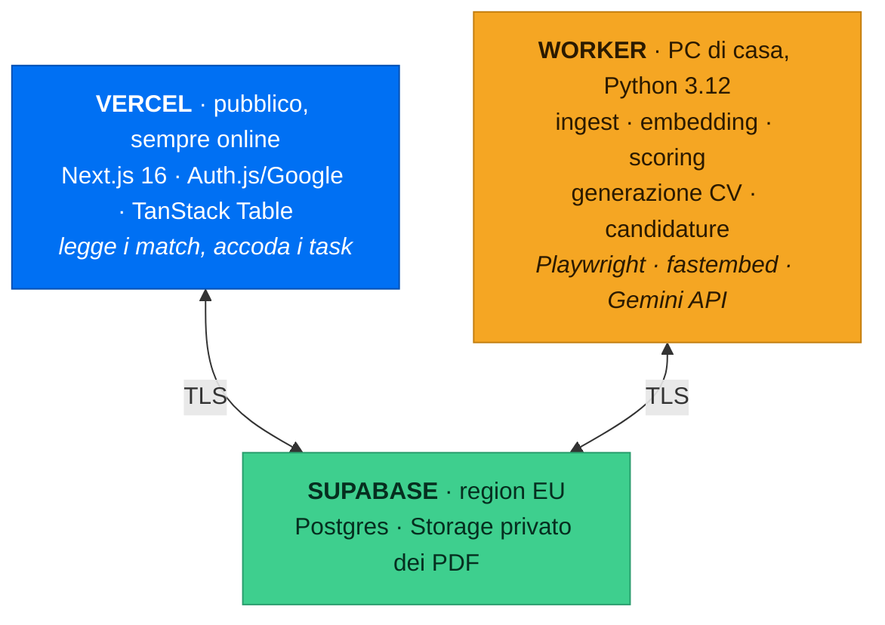

<div align="center">

# JobBoard

**Cerca lavoro mentre dormi.**

Ogni giorno raccoglie annunci da più portali, li confronta con il tuo CV, li ordina per
compatibilità — e con un click genera un CV su misura per quel singolo annuncio e invia
la candidatura.


</div>

---

## Cosa fa

Una dashboard privata, raggiungibile da qualsiasi dispositivo, con una tabella di offerte
già filtrate e valutate:

| Ruolo | Azienda | Luogo | Modalità | RAL | Tipo | Match | |
|---|---|---|---|---|---|---|---|
| Backend Engineer | Acme Srl | Milano | 🔵 Ibrido | 45–55k € | Indeterminato | **87%** | `Candidati` |
| Full-Stack Dev | Globex | Berlino | 🟢 Remote | n.d. | Indeterminato | **74%** | `Candidati` |
| Software Engineer | Initech | Torino | 🟠 On-site | 38–42k € | Determinato | **61%** | `Candidati` |

Premendo **Candidati**, il sistema:

1. legge la job description e ne estrae i requisiti reali
2. riscrive il tuo CV per quell'annuncio — riordinando e riformulando, **senza inventare nulla**
3. lo impagina in **una sola pagina**, ATS-friendly, nella lingua dell'annuncio
4. te lo mostra per approvazione, poi invia la candidatura

La RAL viene mostrata solo se l'annuncio la dichiara davvero. Mai stimata e spacciata per certa.

## Come funziona

```
[1 INGEST] → [2 NORMALIZE + DEDUP] → [3 ENRICH] → [4 MATCH] → [5 DASHBOARD]
                                                                    ↓
                                                   [6 TAILOR CV] → [7 APPLY] → [8 TRACK]
```

Gli stadi 1–4 girano una volta al giorno da soli. Gli stadi 6–7 partono dal tuo click.

### Il matching è un imbuto, non una chiamata a un LLM

Mandare 500 annunci al giorno a un modello linguistico è insostenibile. Mandarne 40 no.
Ogni stadio scarta il più possibile con il metodo più economico disponibile:

| Stadio | Metodo | Costo | Restano |
|---|---|---|---|
| 0 · Hard filter | SQL: lingua, work authorization, seniority, location | zero | ~150 su 500 |
| 1 · Semantico | Embedding multilingua in locale + BM25 sulle keyword | zero | 40 |
| 2 · Rubrica | Gemini Flash Lite, 6 criteri pesati | free tier | punteggio finale |

## Architettura

Split: l'interfaccia sta in cloud ed è sempre raggiungibile, il lavoro pesante gira in locale.



I due lati non si parlano mai direttamente: la UI scrive un task in una coda su Postgres e
il worker lo raccoglie entro 30 secondi (`FOR UPDATE SKIP LOCKED`).

**A PC spento** la dashboard resta consultabile e i task restano in coda fino al riavvio.
La testata mostra sempre se il worker è online, così non c'è mai ambiguità.

<details>
<summary><b>Perché il worker non sta su Vercel</b></summary>

Le funzioni serverless hanno filesystem effimero, bundle limitato a ~250 MB e timeout di
pochi minuti. Non ci stanno Playwright/Chromium, il runtime ONNX per gli embedding, né una
pipeline che macina centinaia di annunci con chiamate LLM.

E l'apply assistito è *headful* per definizione: un browser che devi guardare mentre
compila un form non può girare su un server.

</details>

## Stack

| | Tecnologia | Perché |
|---|---|---|
| **Frontend** | Next.js 16, Tailwind 4, shadcn/ui, TanStack Table | Server-side per Auth.js e per non esporre mai la connection string |
| **Worker** | Python 3.12, SQLAlchemy 2, Alembic, APScheduler | Ecosistema maturo per parsing CV, embedding e automazione browser |
| **Database** | Supabase Postgres, region EU | Un solo servizio per DB *e* storage dei PDF, con signed URL nativi |
| **Embedding** | fastembed + `multilingual-e5-small`, su CPU | Gratis, multilingua IT/EN/DE, gira senza GPU |
| **LLM** | Gemini 2.5 Flash-Lite (scoring) · Flash (CV) | Free tier: l'imbuto tiene il volume LLM cosi' basso da starci dentro |
| **PDF & apply** | Playwright Chromium | Una dipendenza sola per rendering PDF *e* automazione dei form |

## Stato

| Fase | | Contenuto |
|---|---|---|
| 0 · Fondamenta | ✅ | venv, 13 tabelle su Supabase, Alembic, Next.js, shadcn, Playwright |
| 1 · Profilo e CV master | ✅ | Parsing PDF/DOCX, `MasterProfile`, risposte ATS, embedding locale |
| 2 · Ingestione | ✅ | 10 adapter, normalizzazione, parsing RAL, dedup SimHash |
| 3 · Matching | ⬜ | Imbuto a 3 stadi, calibrazione dei pesi |
| 4 · Dashboard | ⬜ | Auth Google, tabella, filtri, drawer di dettaglio |
| 5 · Ponte UI↔worker | ⬜ | Coda task, heartbeat, progresso |
| 6 · Generazione CV | ⬜ | Tailoring ACR, validatore anti-invenzione, fit a una pagina |
| 7 · Candidatura | ⬜ | Tier A automatico, Tier B assistito, guardrail |
| 8 · Run giornaliera | ⬜ | Scheduler, digest email, toggle notifiche |
| 9 · Tracking | ⬜ | Stati, lettura IMAP, classificazione risposte |
| 10 · Rifinitura | ⬜ | Ricalibrazione, costi API, backup |

Dettaglio completo con sottofasi e criteri di verifica in **[docs/ROADMAP.md](docs/ROADMAP.md)**.

## Setup

<details open>
<summary><b>Worker</b> — Python 3.12 richiesto</summary>

```bash
py -3.12 -m venv worker/.venv
worker/.venv/Scripts/python -m pip install -e "worker[dev]"
worker/.venv/Scripts/python -m playwright install chromium
cp .env.example worker/.env      # poi compila le chiavi
worker/.venv/Scripts/jobboard doctor
```

`doctor` verifica ogni chiave, la connessione al database e Playwright, senza mai
stampare il valore di un segreto.

</details>

<details>
<summary><b>Dashboard</b> — Node 20+</summary>

```bash
cd web
npm install
cp .env.local.example .env.local  # poi compila le chiavi
npm run dev
```

</details>

<details>
<summary><b>Quando cambia lo schema del database</b></summary>

I modelli SQLAlchemy sono l'unica fonte di verità. Il lato TypeScript legge i tipi dal
database reale, mai da una seconda definizione.

```bash
# 1. modifica worker/jobboard/models/
cd worker && alembic revision --autogenerate -m "descrizione" && alembic upgrade head
jobboard gen-web-schema        # rigenera i tipi TypeScript
```

</details>

## Struttura

```
├─ worker/              Python 3.12 — tutto il lavoro pesante
│  ├─ jobboard/
│  │  ├─ models/        SQLAlchemy — fonte di verità dello schema
│  │  ├─ sources/       un adapter per ogni portale
│  │  ├─ pipeline/      ingest · normalize · dedup · enrich · match
│  │  ├─ ai/            client · embeddings · validator · prompts
│  │  ├─ cv/            template Jinja2 · render · fit a una pagina
│  │  ├─ apply/         greenhouse · lever · ashby · workable · assisted
│  │  └─ notify/        digest email · lettura IMAP · classificatore
│  └─ alembic/
├─ web/                 Next.js 16 → Vercel
└─ docs/                architettura e roadmap
```

## Una nota sulle fonti

**LinkedIn e Indeed non espongono API pubbliche per la ricerca offerte.** LinkedIn ha solo
la Talent Solutions API, riservata ai partner; Indeed ha chiuso la Publisher API nel 2023.

Questo progetto li copre tramite un aggregatore che indicizza Google for Jobs, **non tramite
scraping** — che violerebbe i loro Terms of Service con rischio concreto di ban dell'account.
La conseguenza onesta è che si vede ciò che Google ha indicizzato, non l'intero portale.

Le job board degli ATS (Greenhouse, Lever, Ashby, Workable) restano la fonte migliore: dati
puliti, e l'unica dove l'invio automatico è documentato e previsto.

## Sicurezza

La dashboard è su internet e contiene un CV, dati personali e un bottone che invia
candidature. Perciò: login Google con allowlist di un solo account, bucket dei PDF privato
servito solo con signed URL a scadenza, connection string mai nel bundle del browser,
dati in region EU, e `dry-run` attivo di default finché non verifichi il primo invio.

---

<div align="center">
<sub><b><a href="docs/ARCHITECTURE.md">Architettura</a></b> · <b><a href="docs/ROADMAP.md">Roadmap</a></b></sub>
</div>
